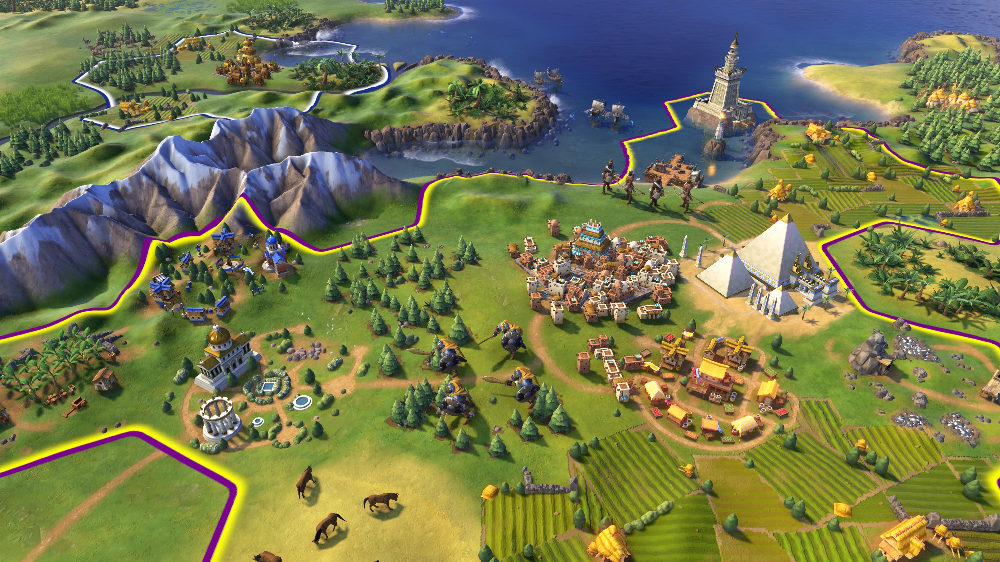
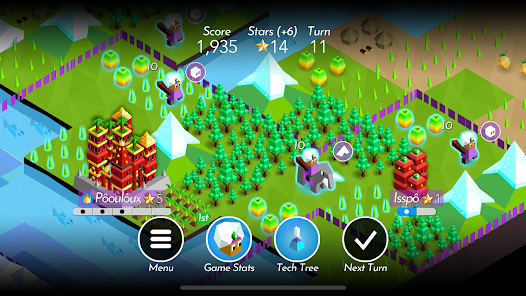
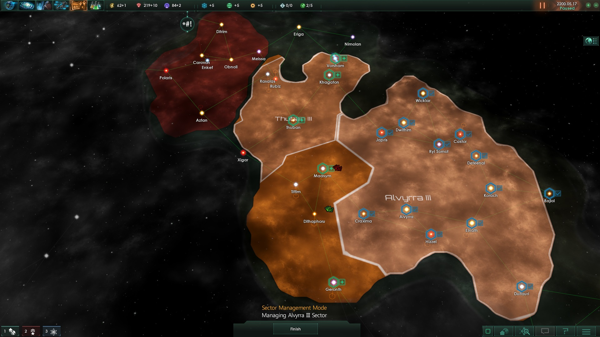
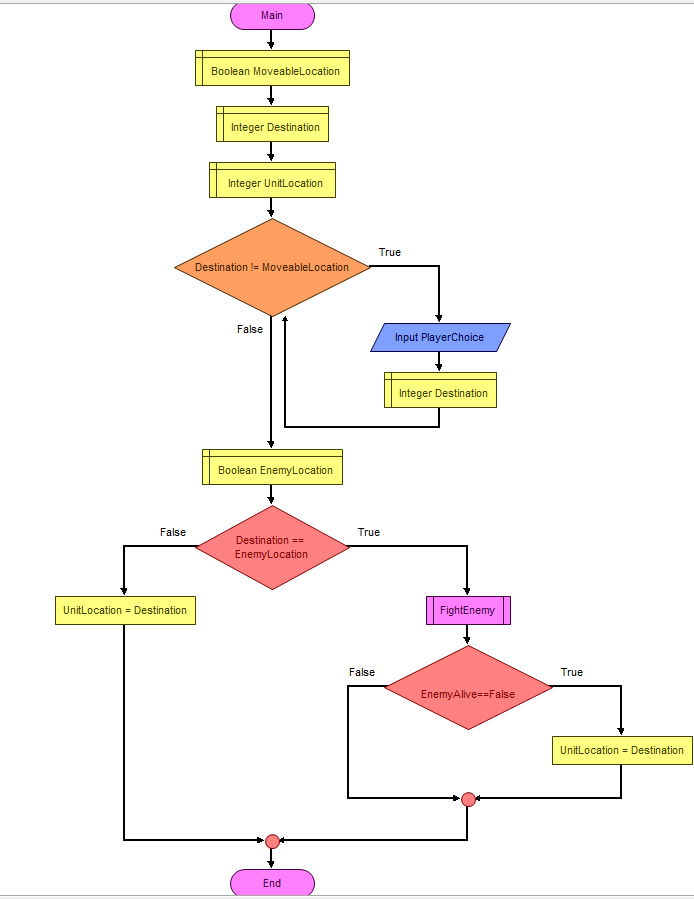

# __Project Portfolio__
## __Identifying and Defining__
### __Brainstorming__
| Idea | P | M | I |
| -- | -- | -- | -- |
| Map strategy | allows for large mechanical depth | easy to make too complicated | many potential games to draw inspiration from |
| Roguelike strategy | popular genre with large wells for inspiration | hard to make an interesting and distinct game | greater stakes for decision-making for the player |
| 4X style game | significant strategical elements | can be overwhelming for new players | allows for a lot of forward planning |

__Chosen Idea:__ 4X style game

### __Identifying a Need__
__Need:__ Helps increase processing ability of players through a challenging strategy game that requires competent situational understanding.\
__Problem Statement:__ There is demand for a game that provides a strategical challenge to the user, to improve mental processing, while also being fun and engaging. A strategy game, something that requires players to try to process a large game environment and make choices based on their assumptions, while also having to make long term planning about what they want to do, would allow for a suitable experience to help improve the processing of the user also being entertaining.

__Skill Development:__ I would use this to learn how to make the grid system: 

### __Requirements Outline__

__Inputs:__ The user will use primarily the mouse, to interact with the visual elements, and the directional keys, to move the players viewpoint. The user may also use hotkeys to open specific menus\
__Processing:__ The game will check that the user's inputs are valid, move the camera, update player statistics, update the map with different components, and perform any menu interaction, like performing a trade interaction with the AI, as well as opening any menus\
__Outputs:__ The game will display the map, and any changes to it, any menus, the player's statistics, and display any player interaction with menus, like a button lighting up when you click on it\
__Transmission:__ This requires no network services to function, as this is meant to be a single player game without any external sourcing\
__Storage:__ The game would save a player's game, and the player's highscore/minimum completion time

### __Functional Requirements__
__User Interaction:__ The user will interact with the game through mouse inputs, primarily to click on buttons that will open menus and interact with the menus, however the player can also use arrow keys to move around the map, and use hotkeys for specific interactions with units or menus.\
__Core Gameplay:__ The player can interact with units, which allow them to move a certain amount of tiles, and potentially initiate combat. Combat will function when two opposing units enter the same square. Combat will be determined by a set of numbers derived from the units, their upgrades, any nearby units, other unique effects. There will also be an economic system that the player can use to produce units, and buildings. Additionally, there is a scientific system, to get more units and buildings to be able to become stronger.\
__Scoring and Feedback:__ The player will be told close they are to victory, and how much they have of different resources.\
__Saving and Loading Data:__ The game will save all games that are in progress and any highscores that the player wishes to save. The game will be stored locally on the users system.

### __Non-Functional Requirements__
__Performance Requirements:__ The game should run at a high speed, and should calculate all turns at a high speed.\
__Usability Requirements:__ The game should be quite intuitive in its UI, but the game will provide an optional tutorial on how to use all the systems in the game. This will be provided through onscreen prompts.\
__Scalability Requirements:__ The game should be open to the implementation of new mechanics and expanded maps for the player to interact without making the game buggy and difficult to play.

### __Consideration of Social and Ethical Issues__
#### __Definitions__
__Equity:__ To provide equity is to make all people in a scenario equal.\
__Accessibility:__ How easy something is to use or obtain.

#### __Paragraphs__
__Accessiblity:__ The game will involve purely visual elements, function at a flexible pace. The game however, doesn't have any options to reduce mouse usage or alternate controls, as there is too many things that it is used to interact with.\
__Privacy and Data Protection:__ The game doesn't need to concern any of this as the entire game is stored locally.\
__Fairness and Representation:__ The game is fully abstracted from real life and will contain no stereotypes.\
__Mental and Emotional Well-Being:__ The game will contain no explicit images or violence, but the game may be difficult to play for some people, which may cause some people to be angry.\
__Cultural Sensitivities:__ The game will not contain any imagery that can have any interpretations as representing other culture in insensitive ways.

## __Researching and Planning__
### __Exploration of Existing Ideas__
| Idea | Plus | Minus | Implication | 
| -- | -- | -- | -- |
| Sid Meier's Civilization VI | The game contains a lot of mechanical depth, making the player use lots of forthought for all of their decisions. The many civilisations and leaders in the game allow for a lot of customisation for the player's game, offering a lot of replayability. | There are a lot of mechanics in the game making it hard for people to understand and get into the game. | Using many mechanics will make it easy to make the game challenging for the player, but it means that I could easily overcomplicat the game and make it unfun. Adding many options for the player to choose at the start of the game would make it much more easily replayable, but would place more work on me to make them balanced with the other mechanics in the game. I will probably use the larger amount of customisation in my game to make the replayability greater. |
| The Battle of Polytopia | The simple and few mechanics allow for players to get into the game quickly because there is a lot less to learn. The small game size also allows for the game to be finished in a short amount of time, which allows for more people to get into it. | The small world that the game takes place in heavily limits the amount of depth and planning that larger game sizes can have. | The use of few mechanics would allow for not employing a large tutorial, leaving most learning up to the player. However this means that the game could become boring quickly. |
| Stellaris | The game uses a pausable timer to represent the time passing in the gameworld, which allows the player to have a lot more flexibility with their actions, and has a large game size, giving a lot of choices to the player. | The timed aspects of the game forces the game to happen at a set pace, meaning that the games can take an excessively long time to complete, and the simulation present in the game can make the game very laggy and hard to play. | I will use the large game size, but I will not use any other of these elements as they would only make the game harder for me to complete and worse to play |

### __Flowcharts__
__Unit Movement:__
\

__Psuedocode:__\

BEGIN FIGHT ENEMY

BEGIN UnitMovement
    INPUT UnitDestination
    INPUT MoveableLocations
    INPUT EnemyLocations
    WHILE UnitDestination NOT IN MoveableLocations THEN
        OUTPUT "Choice not valid"
        INPUT UnitDestination
    ENDWHILE
    IF UnitDestination IN EnemyLocations THEN
        FIGHT ENEMY
        IF EnemyAlive = False THEN
            UnitLocation = UnitDestination
    ELSE
        UnitLocation = UnitDestination
    